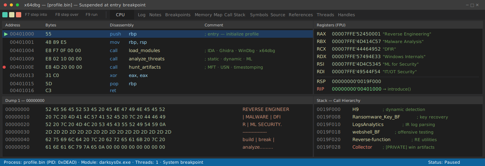

<p align="center">
  
</p>

<h1 align="center">d a r k s y s 0 x</h1>

<p align="center">
  <a href="https://darksys0x.net"></a>
  
</p>

---

### 👨‍💻 About Me

Cyber security professional focused on **DFIR, malware analysis, reverse engineering**, and **IT/OT security**. My day-to-day mixes incident response with hands-on work in Windows internals, kernel debugging, and vulnerability research.

- 🔬 Building and breaking things at the intersection of forensics and low-level systems
- 📝 Publishing original research at **[darksys0x.net](https://darksys0x.net)**
- 🛠️ Currently working on Windows artifact collection tooling and offensive security research
- 🎯 Areas of interest: Windows internals, kernel debugging, EDR development, exploit research, threat hunting
- 🤖 Applying **machine learning** to malware detection, family classification, and automated function identification in reverse engineering
- 🛰️ Exploring applied ML beyond security — including computer vision on remote-sensing / satellite imagery

---

### 🚀 Currently Debugging

```asm
BP 0x00   EDR detection logic                        ; building
BP 0x01   ML — malware family classification         ; researching
BP 0x02   Windows kernel exploitation primitives     ; studying
BP 0x03   darksys0x.net technical writeups           ; writing
```

---

### 🧰 Stack & Tools

**Languages**


**Reverse Engineering & Debugging**


**DFIR Platforms**


**OS & Environments**


**Machine Learning & Data**


---

### 📈 GitHub Stats

<p align="center">
  
  
</p>

---

### 🔬 Research & Writing

I write about Windows internals, vulnerability research, malware reverse engineering, and DFIR methodology on my blog:

- 🌐 **[darksys0x.net](https://darksys0x.net)** — original research and technical deep-dives

Selected topics:

```asm
[CVE-RESEARCH]   ASP.NET VIEWSTATE deserialization in Microsoft Exchange OWA
[DFIR]           Windows forensic artifact collection at scale
[MALWARE]        Manual unpacking & anti-debug bypass on commodity stealers
[ML / DFIR]      PE features, opcode n-grams, behavioral classification, function identification
[ML / VISION]    Computer vision on remote-sensing / satellite imagery (private)
```

---

### 🛠️ Selected Projects (.exports)

| Address | Function | Description | Stack |
| :--- | :--- | :--- | :--- |
| `sub_401000` | **[H9](https://github.com/darksys0x/H9)** | Automatic dynamic malware detection — behavioral analysis for runtime classification | C++ |
| `sub_401200` | **[Ransomware_Key_BruteForce](https://github.com/darksys0x/Ransomware_Key_BruteForce)** | Cryptographic brute-force tooling for recovering keys from ransomware-encrypted artifacts | C++ |
| `sub_401400` | **[LogsAnalytics](https://github.com/darksys0x/LogsAnalytics)** | Log parsing and analytics utilities for incident response and threat hunting | JavaScript |
| `sub_401600` | **[Reverse-function](https://github.com/darksys0x/-Reverse-function)** | Function-level reverse engineering utilities | C++ |
| `sub_401800` | **[HM1-webshell-bruteForce](https://github.com/darksys0x/HM1-webshell-bruteForce)** | Webshell credential brute-force tool for offensive security testing | C |
| `sub_401A00` | **[LMS](https://github.com/TheLawyers/LMS)** | Legal Management System — full-stack web application (side project) | JavaScript |
| `sub_401C00` | **Collector** *(private)* | Windows forensic artifact collector covering 40+ artifact types (MFT, USN Journal, timestomping detection) | C / Win32 API |

> Engagement-specific tooling and ongoing private research are not published.

---

### 📫 Contact

- 🌐 Blog: [darksys0x.net](https://darksys0x.net)
- 💬 GitHub: [@darksys0x](https://github.com/darksys0x)
- 𝕏 Twitter / X: [@darksys0x](https://twitter.com/darksys0x)

---

<p align="center"><i>"Trust the artifacts, not the assumption."</i></p>
